# DfoGmTool

> S4A12 (86jp) 服务端的 Web GM 控制台 — 基于 [rewio/DfoGmTool](https://codeberg.org/rewio/DfoGmTool) 深度重构
>
> 当前开发版 · 对齐服务端提交 **25e6f0a**、数据库 **v52** · MIT License

独立进程运行，读取服务端部署目录里的 `inventory.db` 和 `Script.pvf`；浏览器打开 `http://localhost:5050` 即可使用。发放页默认“邮件发放”，搜索框左侧的单按钮可切换“邮件发放/背包发放”并记忆选择；从邮件切入背包只在该次切换确认一次，刷新恢复已记忆的背包模式不再提示，也没有常驻警告，列表和配置提交文案会随模式更新。请求缺失、空白或未知的 `deliveryMode` 安全回退为邮件。邮件模式下普通装备、装扮、宠物、消耗品、晶块和复活币通过系统邮件发放；背包模式下普通物品复用新版背包直写，晶块直充账号共享状态，复活币直充角色虚拟钱包，容量不足会整体失败回滚。名称装饰卡始终直写 `character_name_tag_state`，`PremiumCatalog` 契约始终直写账号契约状态，不受模式切换影响。邮件项目关闭并重新打开邮箱即可，背包和专用直发项目通常需重新选择角色刷新。其他管理功能继续使用经过版本门禁的数据库服务。源码自包含，不依赖任何本地相邻仓库即可构建和发布。

🔗 **仓库地址**

| 平台 | 地址 |
|------|------|
| Codeberg | <https://codeberg.org/Liuxiny/86jp_DfoGmTool> |
| GitHub | <https://github.com/Liuxiny/86jp_DfoGmTool> |
| 上游原版 | <https://codeberg.org/rewio/DfoGmTool> |

---

## 界面预览

### 发放物品

**装备发放** — 分类树 + 关键词/等级/品质/可用职业多维筛选，名称按品级着色，装备在配置卡片中设置强化/增幅/锻造/红字后确认发放：

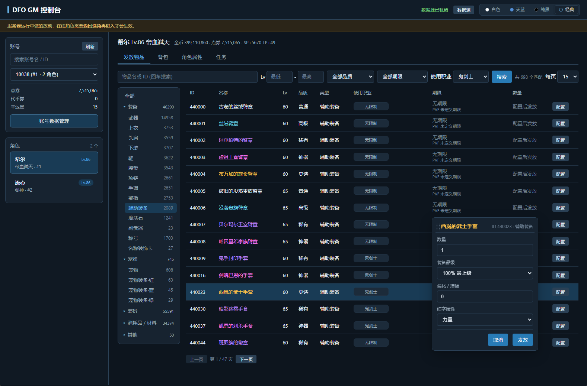

**宠物 / 名称装饰卡** — 宠物与名称装饰卡独立分类：

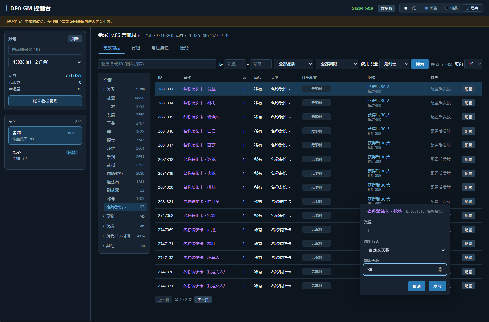

**装扮** — 按当前角色职业过滤可用装扮，上衣/下装等部位属性和技能在配置卡片中选择：

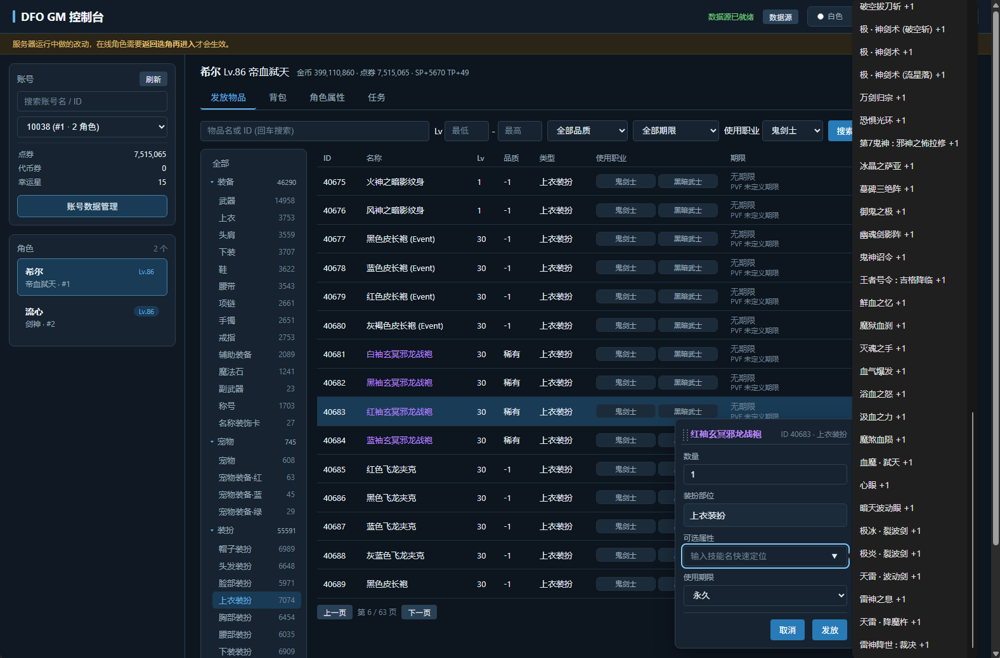

**消耗品 / 材料** — 可叠加物品按背包六段分类，直接输入数量发放：

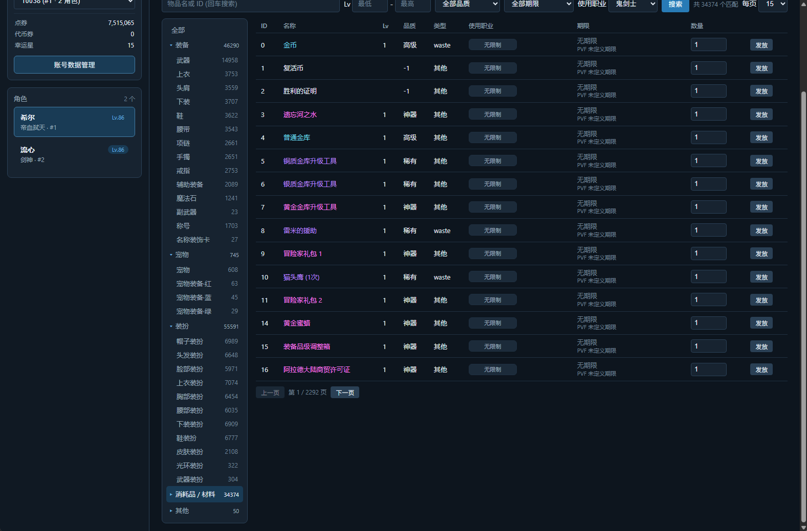

**期限道具** — 期限类道具独立筛选，在配置卡片中设置期限天数后确认发放：

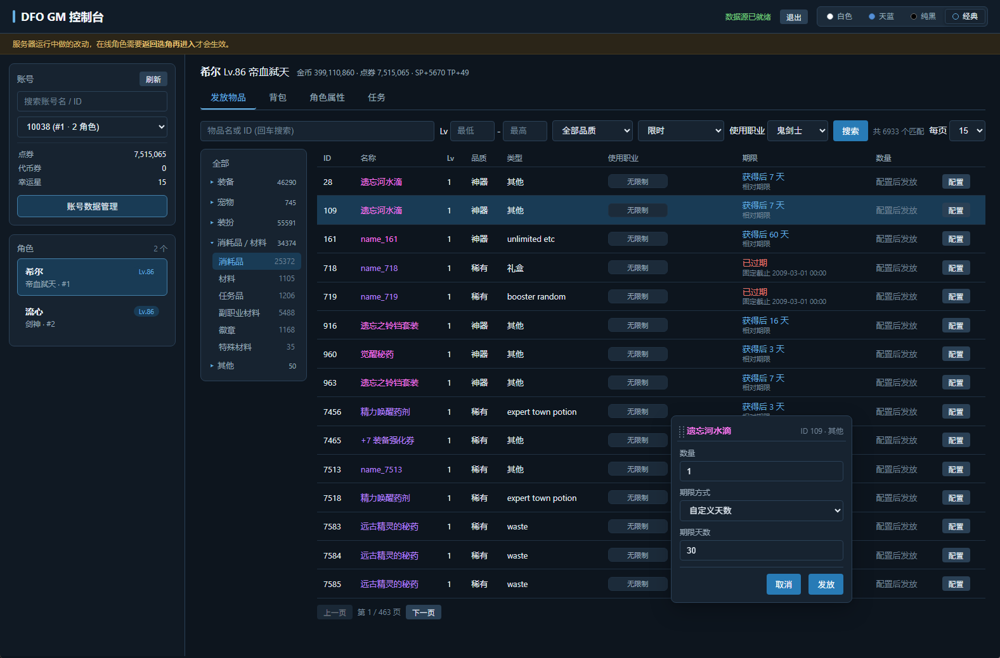

### 背包管理

**装备页** — 按容器分类查看，可配置装备显示「配置」按钮，点击弹出浮动配置卡片修改强化/增幅/锻造/红字，直接更新新版 `ItemCore` 对应字段，不破坏附魔、徽章、异界属性等数据：

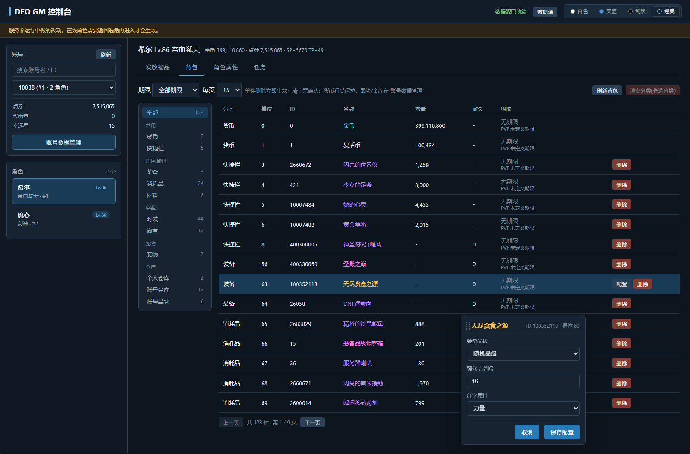

**装扮页** — 可配置装扮显示「配置」按钮，修改部位属性/上衣技能，并保持新版装扮明细与 `ItemCore` 引用一致：

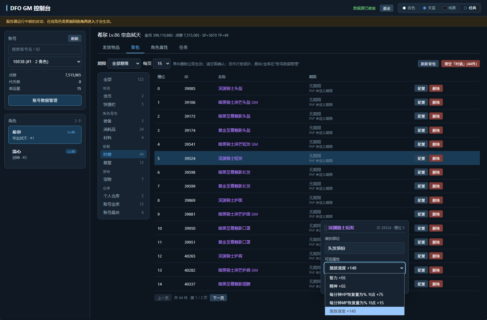

### 角色属性

**等级与转职** — 等级设置与经验阈值联动并重算战斗属性；转职/觉醒通过 PVF 校验后写入，自动重建技能列表、清理旧职业残留、同步转职任务状态：

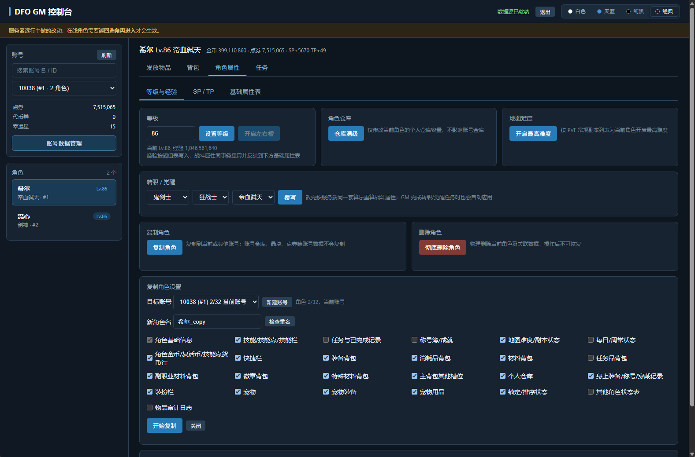

**技能点** — SP/TP 真实剩余/总量查看（区分技能方案页），附加点调整带合法性校验，一键剩余归零：

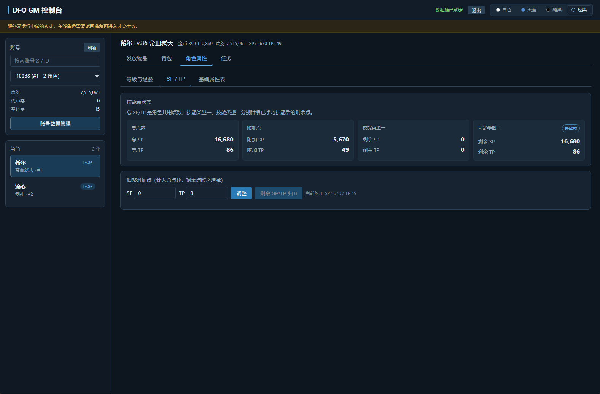

### 任务系统

**全部可见任务** — 按区域分组展示当前等级可见的全部任务，支持一键完成当前等级的主线/支线/系统任务/无需物品的成就任务：

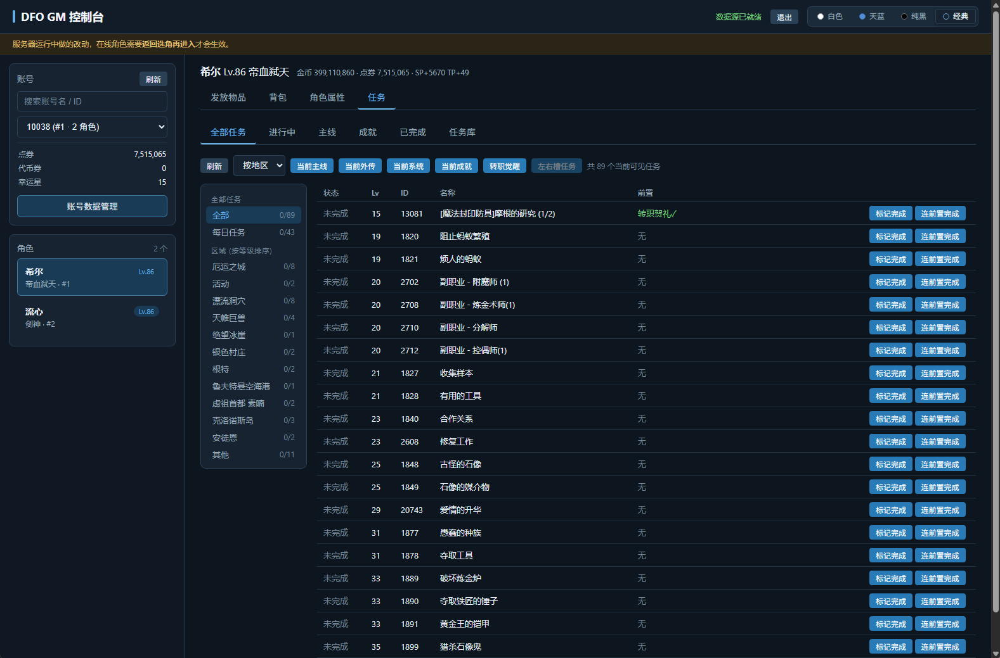

**任务库搜索** — 按类型（主线/普通/每日/重复/成就）和区域过滤，关键词和 ID 搜索：

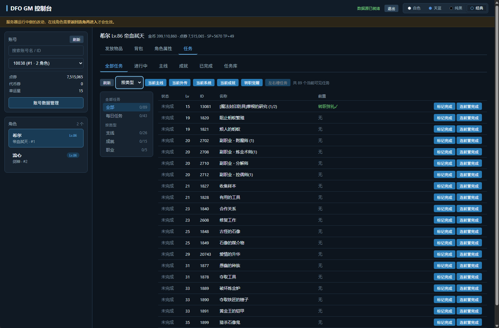

**成就与称号簿** — 称号集合按称号簿五页分类，一键称号簿批量完成全部未完成成就，支持批量取消已完成成就：

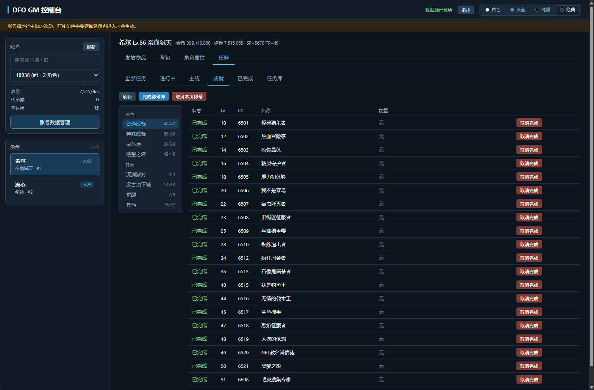

### 背包数据迁移

**旧版/新版背包双向迁移** — 位于「账号数据管理 → 背包数据迁移」。迁移前会统计两侧数据，整个操作在单一数据库事务中执行；异常整体回滚，迁移期间两个方向的按钮同时锁定：


> 迁移时必须先停止游戏服务端并确保没有在线角色。普通物品遇到满包会保留来源数据，并按角色、背包类型和所需空槽位报告；称号簿与名称装饰卡不占普通背包槽位，目标侧已有数据时保留目标侧并清理来源侧。

---

## v260809 服务端兼容更新

- **物品交付边界**：发放页默认邮件，可在搜索框左侧用单按钮切换背包发放；从邮件切入背包仅该次切换确认一次，刷新恢复背包模式不再提示且没有常驻警告，列表/配置提交文案随模式变化。缺失、空白或未知 `deliveryMode` 均安全回退邮件。邮件模式下普通装备、装扮、宠物、消耗品、晶块和复活币走新版系统邮件与附件，背包模式下普通物品复用新版背包直写、晶块直充账号共享状态、复活币直充角色虚拟钱包；背包容量不足整体失败回滚。名称装饰卡始终直写 `character_name_tag_state`，`PremiumCatalog` 契约始终直写账号契约状态，不受模式切换影响。
- **高级属性完整保留**：品级、强化、增幅、锻造、时限、装扮属性和手工类型提示由 GM 使用同步的服务端/PVF 规则校验；邮件模式编码为服务端可直接领取的 `ItemCore` 附件，背包模式复用同一校验后写入新版 `ItemCore`。
- **明确的刷新边界**：GM 是独立进程，无法安全访问服务端在线会话内存，因此不会推送新邮件浮标或刷新已经打开的邮箱；新版服务端会在每次打开邮箱时重新查询邮件表，所以邮件发放后在线角色关闭并重新打开邮箱即可领取，不需要重新选择角色。背包直发以及名称装饰卡、契约直写状态通常需要重新选择角色刷新。
- **邮件堆叠与事务边界**：邮件模式下堆叠物品按当前 PVF 的 stack limit 拆成附件，每封最多 10 个附件；单次最多 10 封、100 个附件。整批邮件在一个 SQLite IMMEDIATE 事务中原子提交并持久化幂等；超过上限会明确拒绝，不会部分发放。背包模式复用新版背包写入，不宣称邮件式跨重启持久幂等。
- **当前角色清空邮箱**：发放页的“清空邮箱”只删除当前角色的 folder=0 收件人；共享邮件仍保留，只有不再被任何收件人引用的根消息、附件和对应系统审计才会清理。
- **异常物品维护**：账号数据管理的“背包数据迁移”后常驻“异常物品清理”页，顶部红色快捷按钮仅在发现异常时出现。它按当前 PVF 扫描所有账号的新版 `character_new_items` 与 `account_cargo_new_items`，排除主背包虚拟货币槽，不扫描旧迁移表、邮箱或称号簿；清理前会重新扫描，并在单一事务中整体提交或回滚。
- **重复提交保护**：浏览器为一次操作生成稳定请求编号并在请求期间锁定发放控件；邮件模式的邮箱事务持久化幂等，相同请求重试返回原邮件，同编号不同内容会被拒绝。背包模式不宣称邮件式跨重启持久幂等，成功提示以服务端 `delivery` 为准。
- **任务 activation 契约**：进行中任务读取并返回 `activation_id/version`；标记可交使用带 activation 的 CAS，重复激活同一任务会生成新的运行身份，旧事件不会污染新任务运行。
- **任务契约可复现同步**：`ActiveQuest`、`QuestRepository`、`QuestSlotLayout` 与 schema、PvfLib 一同从服务端实际 HEAD 同步并记录哈希；每日任务使用最新版 30 个固定进行中槽位。
- **普通/PVP 技能隔离**：转职、觉醒、SP/TP 只重建普通技能方案，不清空或改写 v52 独立 PVP 技能状态。
- **账号级地下城难度**：一键解锁写入最新版 `account_dungeon_permissions`，同账号角色共享，重复执行幂等；不会再清空角色专属的安图恩等机制记录。
- **额外装备槽 bitmask**：状态 `7` 正确识别为左右槽与附加槽均已开启，角色详情、任务残留和前端按钮使用一致的位判断。

## v260729 更新

- **修复新版服务端复制角色回滚**：适配新增的 `dungeon_persistent_effect_outbox`，不再因其事件唯一索引不含角色归属列而中止整个复制事务。
- **隔离运行时事务账本**：动态复制仅自动接纳 `character_*` 角色自有状态表；副本效果 outbox、佣兵奖励 outbox、任务事件 inbox、审计与投递状态不会随角色复制，避免事件身份冲突或奖励重复执行。
- **保留复制安全校验**：没有放宽唯一索引保护；真正的角色状态表仍会检查主键、唯一索引和角色归属列，发现不安全结构时继续回滚。
- **补充回归覆盖**：新增三类运行时账本隔离用例，并验证普通动态角色状态表、全部复制选项与连续复制仍然正常。

## v260725_v1.1 更新

- **完善 07-24 新版背包升级**：旧版穿戴中的装扮、装备、宠物和宠物装备会按角色真实开放容量，依次进入各自背包区间的首个空位，不再沿用穿戴槽编号或写入未开放格子。
- **修复复制角色错误**：复制时重建角色槽位、物品 UID、装扮 UID、宠物 UID 与关联明细；带职业限制的穿戴物自动脱下并进入对应背包，避免复制角色进入客户端后卡死或闪退。
- **统一背包位置判定**：角色复制、旧版背包升级、物品发放和背包配置统一使用新版 `ItemCore` 类型与角色实际扩展状态校验。
- **账号备份格式 v2**：完整覆盖 schema v49-v52 的副职业、任务 activation、账号抽奖、独立 PVP 技能，以及邮箱消息/收件人/附件/系统审计和佣兵奖励明细关系；v1 备份恢复前自动补齐 activation identity，损坏或未来版本会明确拒绝。
- **安全恢复与删除**：账号还原会重建角色槽位，并重映射冲突的装扮、宠物、邮箱消息及审计编号；永久删除会拒绝仍在佣兵出战或奖励邮件尚未投递的角色，只清理已投递的历史奖励。
- **复制选项严格隔离**：v52 PVP 技能只属于“技能”，副职业只属于“其他”，任务 activation 可复制但事件 inbox 不复制；遇到未登记的 `character_*` 表默认停止并提示升级 GM。

## v260725 更新

- **适配 07-24 新版背包架构**：发放、背包查看与整理、装备/装扮配置、角色货币、账号货币、金币、晶块、复活币、账号金库、角色复制、账号备份和称号簿全部切换到新版 `ItemCore` 数据语义，不再保留旧版背包业务兼容路径。
- **背包数据双向迁移**：支持旧版升级新版及新版还原旧版；先处理穿戴数据，再按目标槽位合并，冲突顺序后移，可堆叠物品按 PVF 堆叠上限合并和拆分。
- **事务与残余保护**：每次迁移使用完整事务和进程互斥锁，错误整体回滚；普通背包容量不足时保留来源数据并给出具体角色、背包类型、物品数量和所需空槽位。
- **防止镜像重复**：迁移后完整清理已消费的来源数据；金币、复活币、胜点、晶块及账号金库的旧/新镜像不会再次叠加或复制。
- **称号簿与名称装饰卡**：新版称号簿按每个称号一条数据处理；冲突时以目标侧为准并清理来源侧，不作为满包残余保留。
- **刷新提示**：名称装饰卡和 `PremiumCatalog` 契约是直写专用状态，发放后角色通常必须返回选角并重新进入；邮件发放只需打开或重新打开邮箱，背包直发通常也需返回选角刷新。背包迁移必须在服务端停止且无人在线时执行。

## 相较上游的实际代码变更

本版本在上游 [rewio/DfoGmTool](https://codeberg.org/rewio/DfoGmTool) 基础上进行了深度重构。以下所有变更均基于新旧代码的逐文件对比，非概述性描述。

### 新增服务文件（6 个全新模块）

| 文件 | 行数 | 功能 |
|------|------|------|
| `GmService.AccountBackup.cs` | 940 | 完整账号备份与还原 — 遍历数据库全部关联表（30+ 张表按依赖顺序），导出账号及其角色的所有数据为 JSON，还原时处理外键约束、宠物句柄冲突、角色槽位索引重建、已废弃表兼容 |
| `GmService.CharacterClone.cs` | 738 | 角色复制 — 25 个可选复制类别（背包各分区、装备、装扮、宠物、技能、任务、称号簿、每日/周常、地图难度等），支持跨账号复制、新建目标账号（MD5 密码）、宠物句柄重映射、主键冲突规避 |
| `GmService.CharacterFixes.cs` | 344 | 转职/觉醒重写 — `SetGrowTypeFixed` 增加 PVF 校验 (`TryValidateJobGrowOption`)、等级前置检查、转职后技能列表重建 (`CharacterSkillProfile.BuildSnapshot`) 或觉醒技能合并 (`MergeGrants`)、转职任务状态同步 |
| `GmService.CharacterSpTp.cs` | 226 | SP/TP 管理 — `AdjustSpTpSynced` 每次调整后同步技能点状态（区分双技能方案页），调整前校验负数保护；新增 `ZeroRemainingSpTp` 一键归零 |
| `GmService.InventoryConfiguration.cs` | 694 | 背包物品在线配置 — 直接修改新版 `ItemCore` 的强化、增幅、锻造、红字、品级、期限与装扮能力字段，并维护装扮明细引用 |
| `PvfIndexService.Dungeons.cs` | ~60 | 地下城权限数据读取 |

### 显著扩展的服务文件

| 文件 | 旧 → 新 | 新增内容 |
|------|---------|----------|
| `GmService.Characters.cs` | 18KB → 38KB | `DeleteCharacterPermanently`（二次确认 + 种子角色兜底优选同账号角色）、`UnlockExtraEquipmentSlots`、`UnlockDungeonPermissions`、`MaxPersonalCargo`、`SetWalletValue`（金币/复活币/技能点按类型覆写） |
| `GmService.Inventory.cs` | 19KB → 56KB | `GiveItem` 支持 `ItemGrantOptions` 与 `deliveryMode` 邮件/背包分流；装备发放走 `EquipmentGrantPolicy` 和 `AmplifyInitialValueResolver`，装扮发放按职业过滤走 `AvatarGrantPolicy`，PVF 不存在的物品禁止发放 |
| `GmService.Quests.cs` | 35KB → 73KB | `AllVisibleQuestOverview`（按区域展示全部可见任务）、`CompleteCurrentLevelMainQuests/SideQuests/SystemQuests/NoItemAchievementQuests`（按当前等级批量完成）、`CompleteProfessionQuests`、`ResetVisibleDailyQuests`、`CompleteVisibleQuestBatch`、`CompleteExtraEquipmentSlotQuests`、`UnclearQuestBatch`、任务搜索增加 `grade`/`region` 过滤 |
| `GmService.TitleBook.cs` | 4.6KB → 11KB | `CompleteAllTitleBook` 扩展为完整的批量完成实现 |
| `PvfIndexService.Jobs.cs` | 6KB → 13KB | `TryValidateJobGrowOption` — 转职/觉醒写入前的 PVF 校验 |
| `PvfIndexService.Quests.cs` | 10KB → 18KB | `AllQuestMeta` 属性，任务按区域/等级/类型的多维查询 |
| `PvfIndexService.Items.cs` | 17KB → 25KB | `SearchItems` 新增 `usableJob` 可用职业过滤 |

### 新增 ServerCore 源码

| 文件 | 作用 |
|------|------|
| `ItemGrantOptions.cs` | 发放物品时的装备配置参数模型（品级模式、强化等级、红字类型、锻造等级、期限天数、装扮属性） |
| `CharacterSkillProfile.cs` | 转职后技能列表构建 — `BuildSnapshot` 从零构建、`GetGrowTypeGrants`/`MergeGrants` 觉醒技能合并 |
| `SkillPointLedger.cs` | 技能点收支追踪（双技能方案页） |
| `SkillSlotAllocator.cs` | 技能栏位分配 |
| `AmplifyInitialValueResolver.cs` | 增幅初始值解析（红字属性写入时使用） |
| `AvatarAbilityDataProvider.cs` | 从 PVF `skill/abilitydatas.dat` 和 `etc/avatarabilitystringtable.etc` 动态读取装扮能力数据 |
| `AvatarDurationResolver.cs` | 从 PVF 读取装扮期限档位 |
| `AwakeningSkillGrantProvider.cs` | 觉醒技能授予（配合 `awakening_skill_grants.json`） |
| `ActiveQuest.cs` | 活动任务模型 |
| `PremiumCatalog.cs` | 高级目录数据 |

### 新增前端模块

| 文件 | 大小 | 作用 |
|------|------|------|
| `floating-config.js` | 6KB | 浮动配置卡片 — 装备和装扮发放/背包配置统一使用的弹出式配置面板 |
| `character-sp-overrides.js` | 3.4KB | SP/TP 附加点调整和归零 UI |
| `item-page-size.js` | 1.5KB | 搜索结果动态分页大小控制 |

### 显著扩展的前端文件

| 文件 | 旧 → 新 | 主要变更 |
|------|---------|----------|
| `give.js` | 10KB → 31KB | 装备/装扮/期限道具不再直接行内发放，改为弹出配置卡片确认；装备配置（品级/强化/增幅/锻造/红字）、装扮配置（职业过滤后的部位属性/上衣技能）、期限配置 |
| `character.js` | 4KB → 17KB | 角色删除（带确认框需输入"删除角色"）、角色复制 UI、地下城难度解锁、额外装备栏位解锁、个人仓库满级 |
| `inventory.js` | 9.7KB → 19KB | 可配置装备/装扮显示「配置」按钮、浮动配置卡片集成、期限修改 |
| `quests.js` | 18KB → 34KB | 全部可见任务视图、当前等级一键完成（主线/支线/系统/成就）、每日任务重置、副职业任务完成、批量取消完成、装备栏位任务 |
| `sidebar.js` | 14KB → 17KB | 新功能入口 |
| `bindings.js` | 3.5KB → 6.2KB | 新增模块的事件绑定 |

### 主要新增 API 端点

```
POST /api/accounts/{id}/backup              账号备份导出
POST /api/accounts/restore                   账号备份还原
POST /api/accounts/create-for-clone          为角色复制新建目标账号
POST /api/accounts/{id}/cargo/max            账号金库一键满级
GET  /api/inventory-migration/status          查询新旧背包数据与可迁移状态
POST /api/inventory-migration/legacy-to-new   旧版背包升级新版背包
POST /api/inventory-migration/new-to-legacy   新版背包还原旧版背包
POST /api/characters/{id}/mailbox/clear       清空当前角色 folder=0 邮箱
GET  /api/inventory-anomalies/status          查询全账号异常物品状态
POST /api/inventory-anomalies/clean           重扫并原子清理全账号异常物品
POST /api/characters/{id}/items               发放物品（body 含 requestId、deliveryMode、options）

GET  /api/characters/{id}/items/{tid}/grant-options   发放物品配置选项
GET  /api/characters/{id}/items/config-options        背包物品配置选项
POST /api/characters/{id}/items/configure             背包物品在线配置
GET  /api/characters/{id}/clone-plan                  角色复制计划
POST /api/characters/{id}/clone                       执行角色复制
GET  /api/characters/name-available                   角色名可用性检查
POST /api/characters/{id}/personal-cargo/max          个人仓库一键满级
POST /api/characters/{id}/equipment-slots/unlock       解锁额外装备栏位
POST /api/characters/{id}/dungeon-permissions/unlock   解锁地下城难度
POST /api/characters/{id}/delete                      彻底删除角色
POST /api/characters/{id}/sp/zero-remaining           SP/TP 剩余归零

POST /api/characters/{id}/quests/{qid}/ready?activationId=...  按当前任务运行身份标记可交
POST /api/characters/{id}/quests/{qid}/daily-ready    每日任务标记可交
GET  /api/characters/{id}/quests/all-visible           全部可见任务
POST /api/characters/{id}/quests/all-visible/complete-batch  批量完成可见任务
POST /api/characters/{id}/quests/daily/reset           重置每日任务
POST /api/characters/{id}/quests/unclear-batch         批量取消完成
POST /api/characters/{id}/quests/titlebook/complete-all  一键称号簿
POST /api/characters/{id}/quests/main/complete-current-level     当前等级主线
POST /api/characters/{id}/quests/side/complete-current-level     当前等级支线
POST /api/characters/{id}/quests/system/complete-current-level   当前等级系统任务
POST /api/characters/{id}/quests/achievement-no-item/complete-current-level  无需物品的成就
POST /api/characters/{id}/quests/profession/complete   副职业任务完成
GET  /api/characters/{id}/quests/equipment-slots/status  额外装备栏位任务状态
POST /api/characters/{id}/quests/equipment-slots/complete 完成装备栏位任务
```

### 变更的 API 签名

| 旧签名 | 新签名 | 变更原因 |
|--------|--------|----------|
| `GiveItem(id, templateId, count, pvfIndex)` | `GiveItem(id, templateId, count, options, pvfIndex, requestId, deliveryMode)` | 新增 `ItemGrantOptions`，以及邮件/背包模式分流；缺失或未知 `deliveryMode` 安全回退邮件，`requestId` 用于邮件幂等 |
| `SetGrowType(id, first, second)` | `SetGrowTypeFixed(id, job, first, second)` | 新增职业参数 + PVF 校验 + 技能重建 |
| `AdjustSpTp(id, sp, tp)` | `AdjustSpTpSynced(id, sp, tp)` | 调整后同步技能点状态 + 负数保护 |
| `GetGrowOptions(id)` | `GetGrowOptions(id, job)` | 支持指定职业查询 |
| `SearchQuests(id, q, limit, pvfIndex)` | `SearchQuests(id, q, grade, region, limit, pvfIndex)` | 新增类型/区域过滤 |
| `SearchItems(..., expiration)` | `SearchItems(..., expiration, usableJob)` | 新增可用职业过滤 |

### 自测框架

`SelfTests/` 目录包含五个自测入口：

| 文件 | 行数 | 覆盖范围 |
|------|------|----------|
| `DatabaseCompatibilitySelfTest.cs` | — | 数据库 schema/兼容性门禁与迁移前置校验 |
| `ItemGrantOptionsSelfTest.cs` | ~500 | 装备/装扮/可叠加/期限物品的 `ItemGrantOptions` 处理逻辑 |
| `CharacterMutationSelfTest.cs` | ~1400 | 等级/经验、转职/觉醒、普通/PVP 技能隔离、任务 activation/CAS/事件隔离、账号级地下城权限、角色复制/备份/删除生命周期；邮件堆叠拆分/多邮件幂等回滚、当前角色邮箱清空与共享邮件安全；GiveItem 的 mail/inventory 分流、普通物品/晶块/复活币直发回滚、名称装饰卡与契约专用直写 |
| `InventoryMigrationSelfTest.cs` | — | 新旧背包双向迁移、冲突顺延、可堆叠合并拆分、镜像去重、满包残余与事务回滚 |
| `InventoryMaintenanceSelfTest.cs` | — | PVF 合法 ID、全账号新版角色库存/账号金库异常扫描与清理、虚拟货币槽排除、关联状态精确清理、事务回滚与二次幂等 |

---

## 功能一览

### 📋 账号

- **搜索**：按账号名 / ID 过滤，支持按角色名反查账号
- **货币**：点券 / 代币券 / 幸运星 / 赛利亚幸运值直接覆写
- **晶块**：六种晶块覆写
- **账号金库**：查看、单删、确认后清空、一键满级
- **备份与还原**：导出账号全量数据（含所有角色），还原时自动处理外键和主键冲突
- **背包数据迁移**：旧版/新版双向迁移、事务回滚、容量残余报告与可重试清源
- **异常物品清理**：在当前 PVF 合法 ID 集下扫描全账号新版角色库存与账号金库，清理前重扫并以单事务整体回滚

### 🎮 角色

- **等级**：经验按阈值表写入，战斗属性同事务重算
- **转职 / 觉醒**：PVF 校验 → 写入 → 技能列表重建/觉醒技能合并 → 转职任务状态同步，全链路一次事务完成
- **SP / TP**：真实剩余/总量（区分双技能方案页），附加点调整带合法性校验，一键剩余归零
- **基础属性表**：82 字节属性块全字段解码
- **地下城难度解锁**、**额外装备栏位解锁**、**个人仓库满级**
- **角色删除**：二次确认（需输入"删除角色"），删除后种子角色优选同账号 → 其他有效角色 → 模板角色
- **角色复制**：25 个可选类别，支持跨账号/新建目标账号，宠物句柄自动重映射；运行时 outbox/inbox、审计与投递状态不会随角色复制

### 🎒 背包

- **五组分类侧栏**：常用 / 角色背包 / 穿戴 / 宠物 / 仓库
- **金币 / 复活币 / 技能点**在「货币」分类里按类型覆写
- **装备在线配置**：通过浮动配置卡片修改新版 `ItemCore` 的强化、增幅、锻造、红字、品级和期限字段
- **装扮在线配置**：修改 `ItemCore.AbilityNo` 与装扮明细（部位属性/上衣技能）
- **期限修改**：装扮按 PVF 档位选择，其他物品按天数设置
- 单件删除立即生效；「清空分类」需确认

### 🎁 发放物品

- **分类树**（可折叠）：装备按部位、宠物、装扮、消耗品/材料按背包六段
- **多维筛选**：关键词 / ID + 等级区间 + 品质（7 档 + 3 个数据驱动细分档）+ 可用职业
- **装备发放配置**：品级（随机/100% 最上级）、强化/增幅（最高 31）、武器锻造（最高 8）、红字属性（体力/精神/力量/智力，仅 55 级以上紫色及以上装备）
- **装扮发放配置**：按角色职业过滤 → 上衣技能从 PVF `skill/abilitydatas.dat` 动态读取，其他部位从 `.equ` 的 `[avatar select ability]` 读取
- **期限道具配置**：在配置卡片中设置期限天数
- **清空邮箱**：发放页始终提供当前角色邮箱清空按钮，确认角色名后只清理该角色收件箱
- PVF 不存在的物品禁止发放

**物品交付规则**：发放页默认“邮件发放”，搜索框左侧的单按钮可切换“背包发放”；请求缺失、空白或未知 `deliveryMode` 安全回退邮件。名称装饰卡与 `PremiumCatalog` 契约始终使用专用直写状态，不创建邮件：

| 物品类型 | 邮件发放（默认） | 背包发放 |
|----------|------------------|----------|
| **普通装备、装扮、宠物与消耗品** | GM 按同步的服务端规则创建并冻结 `ItemCore` 邮件附件快照，玩家领取时由服务端校验并写入对应容器 | 复用新版 `NewInventoryStore.TryGrant` 直接写对应容器；背包容量不足整批失败回滚，完成后通常需重新选择角色；不宣称邮件式跨重启持久幂等 |
| **晶块（六种）** | 通过系统邮件发放，领取附件时进入账号共享晶块槽，不占用普通背包格 | 直接充入账号共享晶块状态，完成后通常需重新选择角色 |
| **复活币道具** | 通过系统邮件发放，领取附件时进入角色虚拟钱包槽 | 直接充入角色虚拟钱包，完成后通常需重新选择角色 |
| **名称装饰卡** | 直写 `character_name_tag_state`，不创建邮件；发放后需重新选择角色刷新 | 同左，模式切换不改变专用直写 |
| **契约（`PremiumCatalog`）** | 直写账号契约状态，不创建邮件；发放后需重新选择角色刷新 | 同左，模式切换不改变专用直写 |

邮件模式的堆叠附件按 PVF stack limit 拆分，每封最多 10 个附件、单次最多 10 封/100 个附件；超过上限会拒绝。整批邮件使用一个 SQLite IMMEDIATE 事务原子提交并按请求编号幂等；背包模式不宣称邮件式持久幂等。

### 📜 任务

- **进行中**：标记可交 / 强制完成
- **主线**：按区域分组的任务链树，支持标记完成 / 连前置完成 / 完成整链
- **全部可见任务**：按区域展示，一键完成当前等级主线/支线/系统任务/无需物品的成就任务
- **每日任务**：标记可交、一键重置
- **副职业任务**：一键完成
- **成就**：称号簿五页分类，一键称号簿批量完成，批量取消已完成
- **额外装备栏位任务**：查看状态、一键完成
- **任务库搜索**：关键词/ID + 类型（主线/普通/每日/重复/成就）+ 区域过滤

---

## 架构

```
DfoGmTool/
├── Program.cs              ← ASP.NET Minimal API 入口
├── GmToolHostConfig.cs     ← config.ini 解析 + 本地/远程模式切换
├── GmConfig.cs             ← 数据源定位（DB + PVF）
├── Services/               ← GM 业务逻辑（23 个文件）
│   ├── GmService.cs                        主入口
│   ├── GmService.Accounts.cs               账号管理
│   ├── GmService.AccountBackup.cs          ★ 账号备份还原
│   ├── GmService.Characters.cs             角色属性/等级/转职/删除/解锁
│   ├── GmService.CharacterClone.cs         ★ 角色复制
│   ├── GmService.CharacterFixes.cs         ★ 转职技能重建
│   ├── GmService.CharacterSpTp.cs          ★ SP/TP 同步管理
│   ├── GmService.Inventory.cs              背包与物品发放
│   ├── GmService.InventoryConfiguration.cs ★ 装备/装扮在线配置
│   ├── GmService.Migration.cs              ★ 新旧背包双向迁移 API
│   ├── GmService.Quests.cs                 任务系统
│   ├── GmService.TitleBook.cs              称号簿
│   └── PvfIndexService.*.cs                PVF 索引
├── ServerCore/             ← 服务端业务源码拷贝件
├── PvfLib/                 ← PVF 解析库（GmPvfLib）
├── SelfTests/              ★ 物品发放、角色变更与背包迁移自测
├── wwwroot/                ← 前端（无框架原生 HTML/JS/CSS）
│   ├── index.html
│   ├── style.css
│   └── js/                 ← 12 个脚本（旧版 9 个）
└── config.ini              运行配置
```

> ★ 标记为本次新增文件

### 设计原则

- **物品数据匹配服务端新版语义**：角色物品使用 `character_new_items` + 82 字节 `ItemCore`，账号金库使用 `account_cargo_new_items`，装扮/宠物使用独立明细表；旧物品表只允许由迁移工具读写。
- **迁移可恢复**：旧版与新版背包可双向迁移，单次操作使用完整 SQLite 事务；普通物品容量不足时保留来源数据，修复后可以再次执行。
- 货币走新版虚拟钱包与账号共享字段，等级走 `CharacterProgressService`，任务位图走 `QuestRepository`，新版称号簿按单个称号记录维护。
- 服务端源码以**拷贝件**形式入库（`ServerCore/` + `PvfLib/`），命名空间统一为 `DfoGmTool.ServerCore.*`，逻辑与服务端一致。
- 前端为无依赖的原生 HTML/JS/CSS，新增 `migration.js` 管理迁移状态、二次确认、按钮互锁与报告渲染；静态文件禁缓存。

---

## 快速开始

### 前置条件

- [.NET 10 SDK](https://dot.net)（源码构建）或直接使用发布版（无需安装 .NET）
- 已部署的 S4A12 服务端（包含 `Data/inventory.db` 和 `Data/Pvf/Script.pvf`）

### 构建与运行

```bash
dotnet build DfoGmTool.csproj -c Debug
dotnet run
```

浏览器打开 `http://localhost:5050`。

### 数据源定位

服务端数据目录按以下顺序定位（找到含 `Data/inventory.db` + `Data/Pvf/Script.pvf` 的目录为止）：

1. 命令行参数 `--server-bin <路径>`
2. 环境变量 `DFO_GM_SERVER_BIN`
3. 从工作目录/程序目录逐级向上，找同级的服务端构建输出目录（如 `Server\DfoServer\bin\Debug`）

GM 启动时会先以只读方式检查数据库兼容性，当前只接受完整的 **v52** 结构。空库、旧版库、未来版本库或缺少 v52 必需列的伪兼容库都会在任何 GM 服务创建前停止；GM **不会**创建或升级服务端数据库。请先用对应版本服务端完成数据库初始化/升级。

仓库中的 `ServerCore/Sqlite/item_schema.sql`、三个任务运行契约与 `PvfLib/` 由 `sync-server-contracts.ps1` 从指定服务端源码同步，版本、schema 哈希、任务契约哈希和 46 个 PVF 源文件哈希记录在 `server-contract-manifest.json`。服务端提交 `211663c` 与同版本自带 PVF 的包头格式不一致，因此同步流程暂时应用一项显式兼容补丁：同时读取 guarded/unguarded 包头，并在写回时保持原格式。

---

## 发布

### Windows

```bash
dotnet publish DfoGmTool.csproj -c Release -r win-x64 --self-contained true -o bin\publish
```

产物自包含（约 110MB，目标机器无需安装 .NET），拷走整个目录即可。
目标机器上用 `--server-bin` 或环境变量指向该机的服务端数据目录。

### Linux

```bash
dotnet publish DfoGmTool.csproj -c Release -r linux-x64 --self-contained true -o bin/publish
```

代码无 P/Invoke、无 Windows 专属编码，SQLite 原生库随发布件自带。注意：
- 可执行文件需要 `chmod +x DfoGmTool`
- Linux 文件系统区分大小写，路径必须是 `Data/inventory.db`、`Data/Pvf/Script.pvf` 的准确大小写

> win-x64 发布件经过完整回归，linux-x64 仅验证到发布产物层、未实机运行过。

---

---

## 配置文件

`config.ini` 位于程序同目录，首次启动自动从内嵌资源生成。修改后需重启。

```ini
# false = 仅监听 localhost，不需要登录，页面可选择数据源
# true  = 监听 0.0.0.0，强制密码登录，数据源由 config.ini 锁定
allow_remote_access=false
listen_port=5050

# 仅 allow_remote_access=true 时必填，至少 8 字符
remote_password=

# 远程模式必须填写的绝对路径
database_path=
pvf_path=
```

> ⚠️ 工具自身使用 HTTP，不要暴露到公网。跨网段请配合防火墙白名单、VPN、SSH 隧道或 HTTPS 反向代理。

---

## 自测

```bash
DfoGmTool.exe --selftest-item-grant-options
DfoGmTool.exe --selftest-database-compatibility
DfoGmTool.exe --selftest-character-mutations
DfoGmTool.exe --selftest-inventory-migration
DfoGmTool.exe --selftest-inventory-maintenance
```

---

## 注意事项

- 📬 **邮件发放后请打开邮箱领取；若邮箱已经打开，请关闭后重新打开，无需重新选择角色**。背包直发以及名称装饰卡和 `PremiumCatalog` 契约直写通常需重新选择角色刷新。GM 不修改服务端实现，也不直接访问在线会话内存，因此不会推送新邮件浮标，也不提供已打开邮箱的实时刷新；发放页请求期间会锁定按钮，成功提示以服务端 `delivery` 为准。
- ⚡ 背包配置、角色属性等直接管理操作仍可能需要返回选角再进入才能看到改动。
- 🔁 **执行背包数据迁移前必须停止游戏服务端，并确保没有在线角色**；不要在迁移事务执行期间启动服务端。
- ⏳ 物品/任务索引启动后后台构建（约 15 秒），页面顶部显示状态，构建完成前发放不校验物品 ID。
- 🎯 强制完成任务不发奖励；想拿奖励用「标记可交」然后回城正常交付。
- 🗑️ 清空类操作有确认框；单件删除立即生效不可撤销。
- ⚠️ **异常物品清理是面向全账号的不可撤销数据库操作**，会按当前 PVF 重扫新版角色库存与账号金库；执行前请先备份 `inventory.db`，并停止游戏服务端、确保没有在线角色。
- 💾 改动前建议备份 `inventory.db`（种子数据不会自动重建）。
- 🔒 远程模式的密码务必修改，不要使用默认值。

---

## 致谢

本项目基于 [rewio/DfoGmTool](https://codeberg.org/rewio/DfoGmTool) 开发，感谢原作者的出色工作。

## 许可

[MIT License](LICENSE) © 2026 rewio
